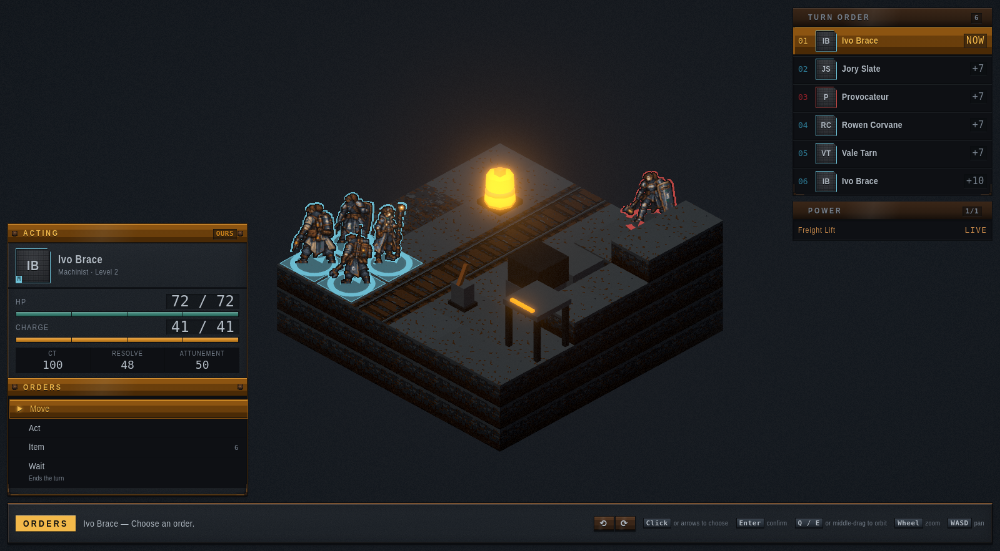
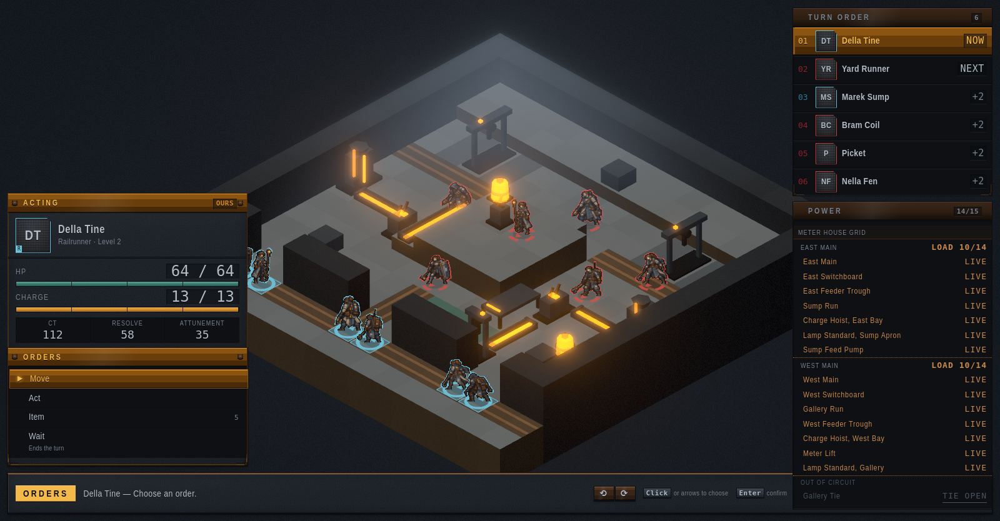

# Greyfall

A tactics RPG with Final Fantasy Tactics' mechanical skeleton in an original
industrial-fantasy setting — magic as an industrial resource ("flux"), refined
and piped like electricity, in a soot-stained factory city run on paperwork.
The battlefield itself is a system: operable machinery, destructible terrain,
and networked power grids you and the enemy fight over.



## What's here

- **A complete vertical slice**: a five-battle chapter with a full progression
  loop (per-job Standing, ability learning, equipment, permadeath that banks
  and buries), plus a grid-warfare skirmish campaign.
- **A deterministic, headless core** — pure `applyCommand(state, cmd) →
  {state, events}`, seeded RNG, integer math. The whole game runs in Node for
  tests and for the AI-vs-AI balance simulator that tuned every encounter.
- **The flux grid**: power as a graph. Sources, lines, breakers, and sinks;
  cut it, splice it, overdraw it until the mains trip. The enemy fights to
  put power back.
- **CT turn order, facing, charge-time casting**, seven jobs
  (Enforcer, Machinist, Conduit, Saboteur, Chemist, Augmented, Railrunner),
  Resolve/Attunement in place of Brave/Faith.
- **HD-2D presentation**: Three.js terrain with billboarded 64×96 pixel-art
  sprites, selective bloom on flux emissives, an orthographic camera, and a
  DOM chrome built like the setting's own field instruments.



## Running it

Node 22.12 or newer.

```
npm install
npm run dev         # play at the printed local URL
npm test            # full suite (engine, content, sim, UI)
npm run test:fast   # the same suite minus the minutes-long balance sweeps
npm run typecheck   # tsc --noEmit
npm run build       # production bundle into dist/
```

Two more scripts need something the clone does not bring with it.
`npm run shots` regenerates the README screenshots against the real app and
needs a Chrome or Chromium binary on `PATH` (`google-chrome`,
`chromium-browser`, or `chromium`); `npm run gallery` dumps sprite contact
sheets and fetches `tsx` through `npx`.

## The docs are the game

Design truth lives in `docs/` and content lives as JSON in `data/`, validated
by the zod schemas in `src/data/schemas/`:

- `docs/CREATIVE_BIBLE.md` — the setting's constitution
- `docs/STORY_BIBLE.md` — the campaign, breadth-first
- `docs/ARCHITECTURE.md` — dependency and determinism rules (binding)
- `docs/COMBAT_RULES.md` — every formula as shipped
- `docs/design/FLUX_GRID.md` — the grid mechanic, decisions with reasons
- `docs/BALANCE_REPORT.md` — the simulator's evidence trail
- `docs/design/GENRE_SURVEY.md` — what the genre offers and what fits

Character, terrain, object, and portrait art are produced externally from the
generator briefs in `art-src/` and ingested through the pipeline in `src/art/`
(dependency-free PNG codec included).

## Licensing

Split license: the **code** is MIT (see `LICENSE`); the **game content** — the
art in `art-src/` and `src/art/masters/`, everything in `data/` and `docs/`,
and the Greyfall setting, characters, and story — is **all rights reserved**
(see `LICENSE-ASSETS`). Build the engine into whatever you like; the game
itself is not up for grabs.
